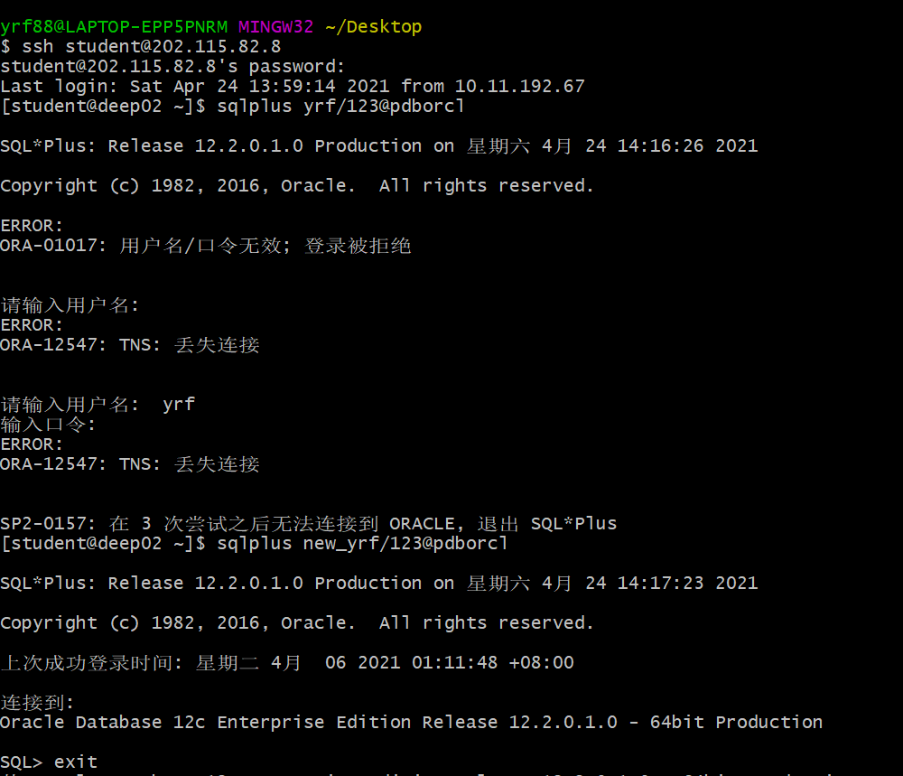

# 实验4：对象管理

## 姓名：殷入风，学号：201810414425

## 实验目的：
了解Oracle表和视图的概念，学习使用SQL语句Create Table创建表，学习Select语句插入，修改，删除以及查询数据，学习使用SQL语句创建视图，学习部分存储过程和触发器的使用。
## - 实验场景：
假设有一个生产某个产品的单位，单位接受网上订单进行产品的销售。通过实验模拟这个单位的部分信息：员工表，部门表，订单表，订单详单表。

## 实验内容：
1.以system身份登录并创建new_yrf角色并授权：


3.首先创建自己的账号 new_yrf，然后以 system 身份登录: 

```sql
    ALTER USER new_yrf QUOTA UNLIMITED ON USERS;
    ALTER USER new_yrf_lfh QUOTA UNLIMITED ON USERS02;
    ALTER USER new_yrf QUOTA UNLIMITED ON USERS03;
```

 

2.用自己的账号new_yrf登录,并运行脚本文件 test3.sql: 

```sql
    cat test3.sql
```

 

```sql
    sqlplus new_yrf/123@localhost/pdborcl
    @test3.sql
```


## 查看数据库的使用情况
以下样例查看表空间的数据库文件，以及每个文件的磁盘占用情况。


## 实验总结
经过本次实验，我学习到了分区表的创建方法，通过实验以及浏览网上相关资料，基本掌握了各种分区方式的使用场景。实验不难，只要跟着老师的调子走，就能顺利完成。
